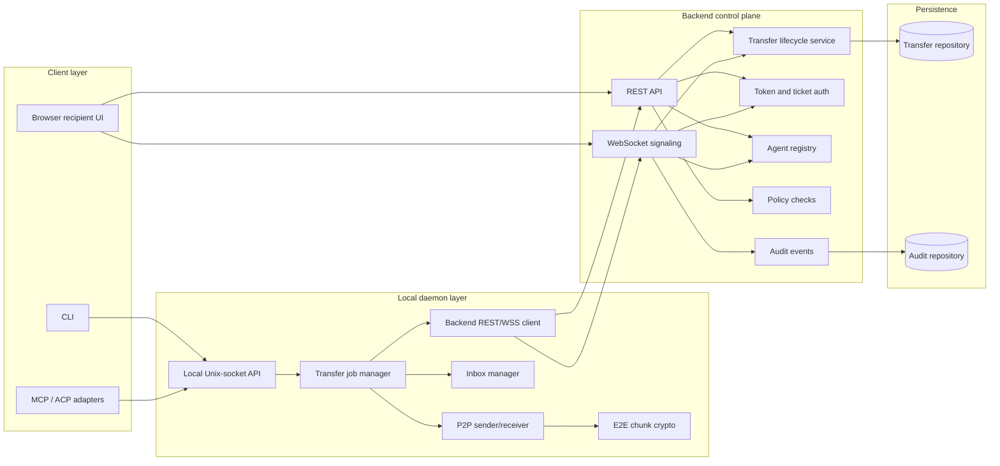
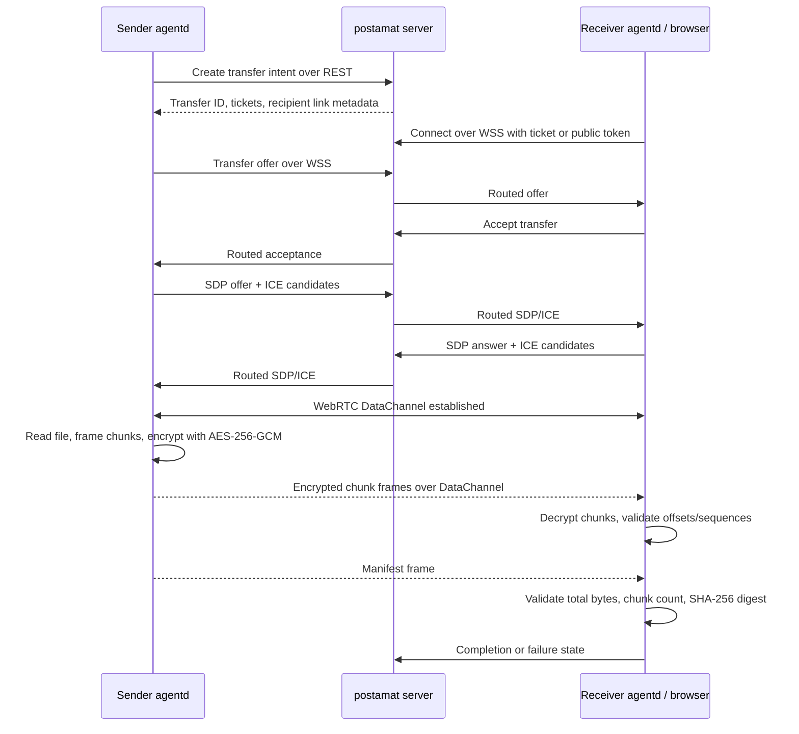
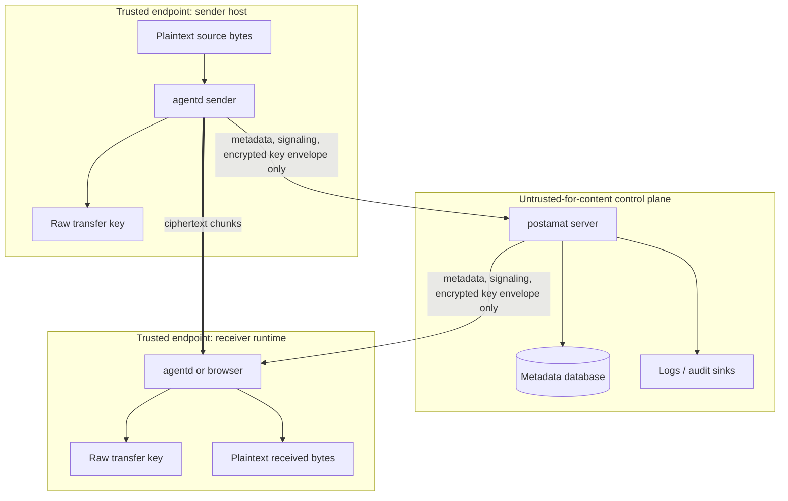
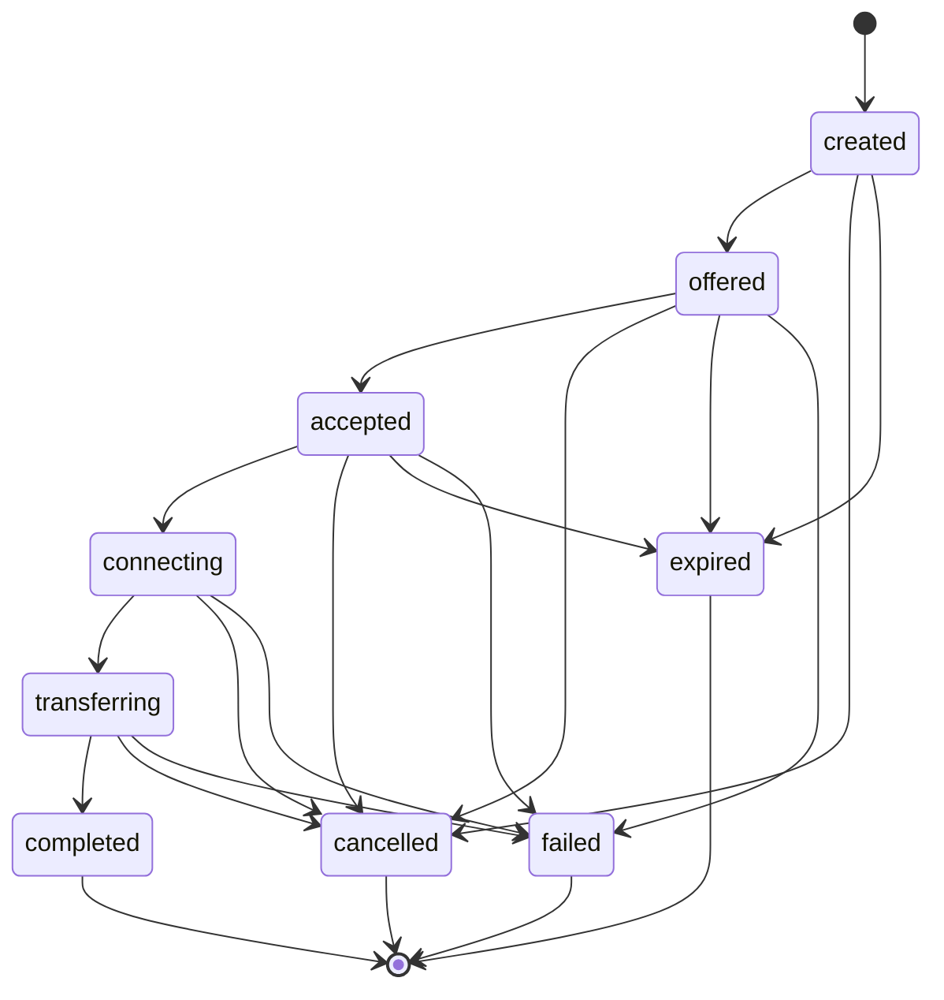
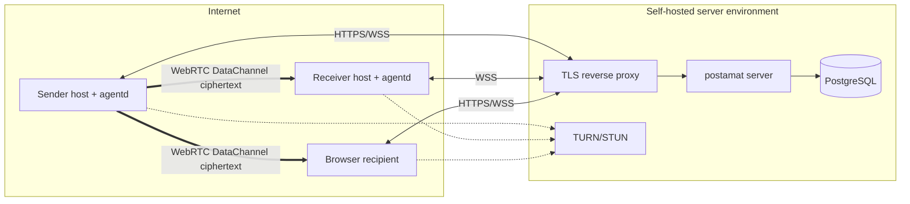

# postamat architecture

postamat separates coordination from content transfer. The backend is a control plane for identity, intent, signaling, policy, and audit; file bytes are a peer-to-peer data plane between endpoints and are encrypted before they leave the sender runtime.

## Architectural principles

- **Control plane, not file host:** the server coordinates transfers and stores metadata; it must not receive plaintext file bytes or raw transfer keys.
- **Agent-native by default:** long-running transfer work belongs to local `postamat agentd` daemons that can serve automation clients over a local API.
- **Browser recipients as first-class endpoints:** a public `/p/{token}` page participates in the same signaling model as agent daemons.
- **Canonical REST + WebSocket contract:** CLI, daemon, browser, and future adapters share the same backend semantics.
- **Fail-closed security defaults:** encrypted chunks are required by default; plaintext is only allowed in explicit legacy tests.
- **Self-hostable infrastructure:** the architecture assumes ordinary Linux hosts, TLS reverse proxies, PostgreSQL, and optional TURN for difficult NAT paths.

## System context

```mermaid
flowchart TB
  subgraph Users[Users and automation]
    agentA[AI agent / automation A]
    agentB[AI agent / automation B]
    human[Human recipient]
    operator[Self-hosting operator]
  end

  subgraph LocalA[Sender host]
    cliA[postamat CLI]
    daemonA[postamat agentd]
    fileA[(Local source files)]
  end

  subgraph LocalB[Receiver host]
    cliB[postamat CLI]
    daemonB[postamat agentd]
    inboxB[(Local inbox)]
  end

  subgraph BrowserHost[Recipient browser]
    page[/p/{token} web app]
    download[(Browser download)]
  end

  subgraph ServerSide[Self-hosted control plane]
    proxy[TLS reverse proxy]
    server[postamat server]
    pg[(PostgreSQL)]
    turn[TURN/STUN service]
  end

  agentA --> cliA --> daemonA
  fileA --> daemonA
  agentB --> cliB --> daemonB
  daemonB --> inboxB
  human --> page --> download
  operator --> proxy

  daemonA <-->|HTTPS REST + WSS| proxy
  daemonB <-->|Outbound WSS| proxy
  page <-->|HTTPS + WSS| proxy
  proxy --> server
  server --> pg
  daemonA -. ICE candidates .-> turn
  daemonB -. ICE candidates .-> turn
  page -. ICE candidates .-> turn

  daemonA ==>|E2E encrypted WebRTC DataChannel| daemonB
  daemonA ==>|E2E encrypted WebRTC DataChannel| page
```

## Component model



## Control plane

The control plane is all metadata and coordination:

- create/list/get/cancel transfer intents;
- issue and verify agent/browser transfer tickets;
- maintain agent presence over outbound WebSocket connections;
- route transfer offers, acceptances, SDP, and ICE envelopes;
- persist lifecycle and audit metadata;
- enforce expiry, cancellation, identity, and policy decisions.

The backend can observe transfer IDs, participants, lifecycle state, timestamps, routing metadata, audit-safe event payloads, and transient SDP/ICE signaling envelopes needed to establish WebRTC connectivity. It must not observe plaintext bytes, raw E2E keys, URL-fragment secrets, or decrypted file manifests beyond explicitly public metadata. SDP/ICE payloads can contain network metadata and should be treated as sensitive transient routing data: route them, redact them from logs, and avoid persisting them unless a future diagnostic mode makes retention explicit.

## Data plane



## Chunk protocol and encryption

The P2P data plane uses explicit frames rather than raw byte streams:

- protocol version;
- transfer ID;
- monotonic chunk sequence;
- byte offset;
- final manifest with total bytes, chunk count, and SHA-256 digest;
- per-frame encryption metadata with algorithm and nonce.

Chunks are encrypted with AES-256-GCM. AEAD additional authenticated data binds ciphertext to protocol version, transfer ID, sequence, and offset. Receivers validate manifests over decrypted plaintext. Zero-byte transfers still send an encrypted sentinel chunk to prove possession of the transfer key before completion.

Key delivery is intentionally backend-invisible:

- agent-to-agent transfers use wrapped transfer-key envelopes;
- browser recipient links carry key material in the URL fragment, which is not sent to the backend by browsers;
- backend JSON payloads must not serialize raw transfer keys.

## Trust boundaries



Security invariants:

- server-side logs must redact tokens, tickets, raw keys, URL fragments, SDP/ICE payloads, and plaintext file contents;
- bearer tokens, public tokens, and transfer tickets are stored as hashes or verifiable non-plaintext forms;
- all production HTTP/WebSocket traffic should terminate at TLS;
- `agentd` local APIs should use restrictive Unix socket permissions;
- inbox writes must defend against traversal, symlinks, collisions, and unsafe metadata-derived paths.

## Transfer lifecycle



Terminal states are `completed`, `failed`, `cancelled`, and `expired`. If an endpoint disappears during connection or transfer, the active transfer is failed and callers create a new transfer. Resume and per-chunk acknowledgements are separate reliability features rather than hidden implicit behavior.

## Storage model

Persistent storage is metadata-only:

- transfer ID and lifecycle state;
- sender/receiver agent IDs;
- public-token hash and ticket verification material;
- expiry and completion timestamps;
- audit-safe events and redacted payloads.

The current architecture avoids server-side plaintext file storage. Future encrypted-at-rest relay or offline modes must preserve the no-plaintext-control-plane invariant and make storage mode explicit in API, policy, retention, and audit records.

## Deployment view

A typical self-hosted deployment contains:

- `postamat server` behind a TLS reverse proxy;
- PostgreSQL for transfer and audit metadata;
- a TURN/STUN service for NAT traversal when direct peer connectivity fails;
- local `postamat agentd` processes on sender/receiver hosts;
- optional browser recipients served by the backend at `/p/{token}`;
- CI/CD that runs frontend build before Go package loading because the Go server embeds generated recipient assets.



## Open extension points

The architecture leaves room for additional open-source modules without changing the core separation of concerns:

- resumable large-file transfers and per-chunk acknowledgements;
- encrypted relay/offline storage mode with explicit retention policy;
- reverse upload links;
- short-code CLI pairing;
- MCP/ACP adapters over local `agentd` APIs;
- deployment recipes for Docker Compose, Kubernetes, coturn, and reverse proxies;
- external policy engines and enterprise identity integrations.
